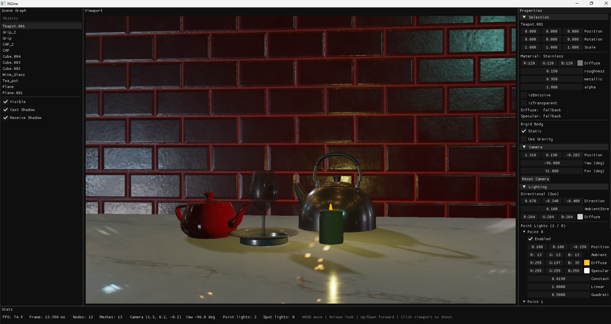
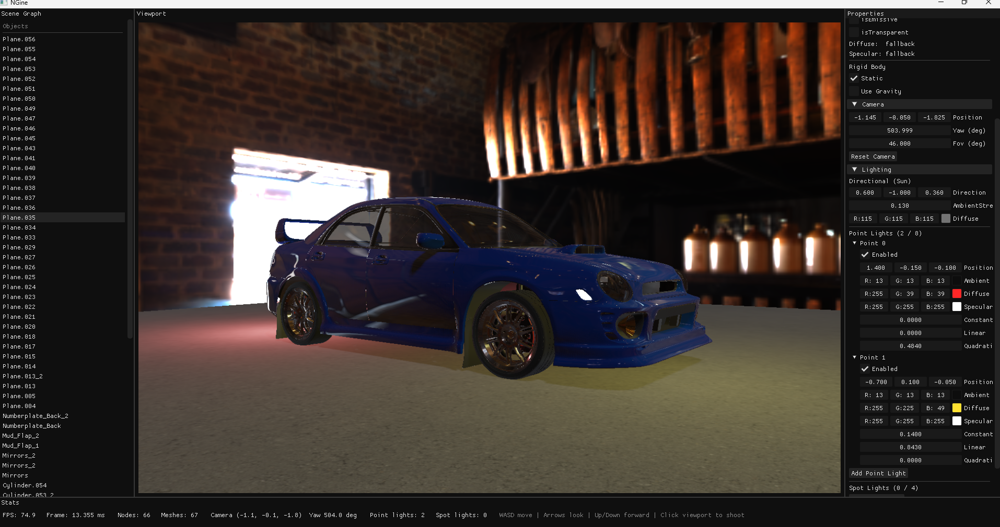

# PROJECT NGINE

This project is practically a testbed for everything I have learned studying computer Science. Since its a long term project without nessicarly a purpose or direction, I have set out a few general goals for it: 

1. To follow good software design principles in order to make it  easily extensible and understandable. My programming languages design and implementation Professor used to quote knuth's: programming is the art of telling another human being what you want the computer to do. I find that with bad design, it doesnt only get become exponentially harder to extend software, but it also makes it increasingly hard for myself to understand what the purpose of my own code is. Another thing is memory safety, ownership, and seperation of concerns. i.e RAII, and smart pointers.
2. To efficiently make use of resources. the cool thing about games is that they are very demanding, in most other toy projects (ML aside) and with the type of hardware that is common nowadays, it is difficult to face serious performance bottlenecks which, I think, invites bad practices and bloat. luckily graphics/physics are not as forgiving. Simulating the world afterall can be very expensive. Therefore I'd like to be mindful of performance. Things like parallization, reducing driver overhead, std::move semantics, and well chosen datastructures, to that end, I would like to move on to Vulkan eventually.. 
3. To do things from first principles. Above all, this is the primary goal of this project. Usually one must not rebuild the wheel unless the goal is to learn how the wheel works, in which case, one may very well rebuild the wheel. There are limits to this, however, it'd be fun to implement the graphics pipeline from scratch. See the great [OneLoneCoder](https://github.com/OneLoneCoder)'s work on that, but unless one is able to do the same thing on a GPU, it would be too slow to be useful for implementing more complex features. In general, beyond the OpenGL api and its windowing libraries, IMGUI, the standard library, and stb_image, I would like to implement everything else I need on my own. P.S I already broke that rule and used tinyOBJ because I was lazy but we shall ignore that.

## Features so far

- A small ad-hoc matrix/vector library that performs all nessicary matrix/vector math.  
- OBJ model loading
- Scene hiararchy: different objects represented as nodes (sharing materials)
- SkyBox rendering (cubemapping) 
- PBR with Texture Mapping (Diffuse, Roughness, Metallic, Normal, AO)
- Emissive & Transparent Materials WIP
- Rienhard tonemapping + Gamma correction
- Shadow Mapping
- lighting (Directional, Point, and Spot Lights) WIP
- UI system 
- rigid body physics (on Seperate thread) WIP.
- wireframe rendering of RigidBody Bounding Boxes
- Image based Diffuse/ Specular Lighting 

## TBD
- Extending Physx to be actually useful
- Bloom
- Gizmos for light sources
- Object Selection using mouse cursor (screenToWorld project)
- Json Scene description import / export
- Cube mapped shadows for Point Lights
- Planar reflections with projective texture mapping
- Foilage rendering with Geometry shader
- Light probes?
- indirect rendering to reduce drawcalls
- multiple rendering passes (deferred rendering)
  

### High-Level Structure

For a Diagram of the Architecture:
https://link.excalidraw.com/l/4sFYiHS90EW/AyscVUlVxQg

The engine is structured as:

- **Application** – Owns the GLFW window, config, and scene; runs the main loop. owns shaders, physics system, and the render pipeline. Single entry point from `main()`.
- **Config / AppArgs** – Centralized window size, FOV, near/far, and all asset paths (OBJ, textures, shaders). 
- **Scene** – Holds camera, mesh + texture, model transform, lighting, background color, and UI flags. 
- **Camera** – Position, yaw (radians), up vector, FOV. Produces view matrix via look-at + invert and projection.
- **RenderPipeline** – Given scene and simulator, performs a fixed draw order

