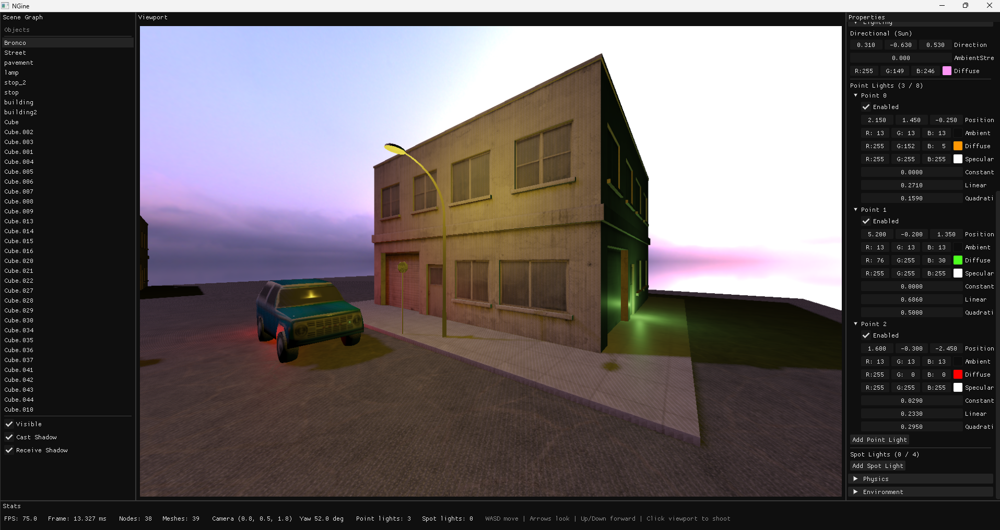
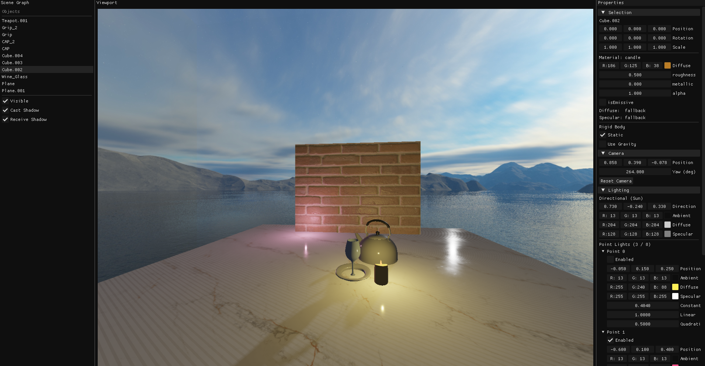
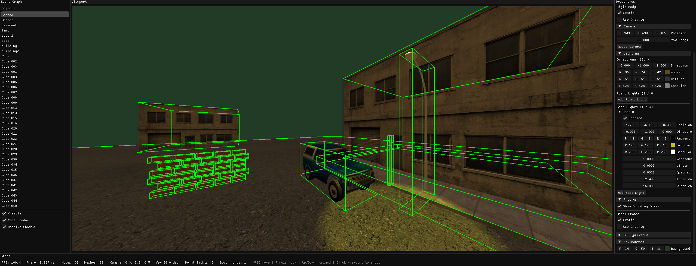

# PROJECT NGINE

The long term aspiration of this project is to become a small 3D engine that supports features I consider interesting Like importing models, rasterization, basic mesh editing, Rigid body physics, particle simulation, rasterization and perhaps eventually raytracing. Performance is particularly an aspect I care about, so when opportunity permits, we would like to make use of efficient data structures. As one might expect from the lack of structure of this project, the intention is not to produce a functionining product but purely to satisfy my curiosity.

## Features so far

- A small ad-hoc matrix/vector library that performs all nessicary matrix/vector math.  
- OBJ model loading
- Scene hiararchy: different objects represented as nodes (sharing materials)
- SkyBox rendering (cubemapping) 
- PBR with Texture Mapping (Diffuse, Roughness, Metallic, Normal, AO)
- Emissive & Transparent Materials WIP
- Rienhard tonemapping + Gamma correction
- Shadow Mapping
- lighting (Directional, Point, and Spot Lights) WIP
- UI system 
- rigid body physics (on Seperate thread) WIP.
- wireframe rendering of RigidBody Bounding Boxes
 

## TBD
- Extending Physx to be actually useful
- Fix multiple shadow problems
- Fix incorrect tangent/bitangent calc
- Extend PBR and shadows to support Point & Spot Lights (currently only works on directional)
- Environment Based Lighting
- Scene description through a Json and a parser or even USD?
- Foilage rendering with Geometry shader
- Light probes?
- multiple rendering passes (deferred rendering)
  

### High-Level Structure

For a Diagram of the Architecture:
https://link.excalidraw.com/l/4sFYiHS90EW/AyscVUlVxQg

The engine is structured as:

- **Application** – Owns the GLFW window, config, and scene; runs the main loop (`init` → `run`); owns the Phong shader, particle renderer, and the render pipeline. Single entry point from `main()`.
- **Config / AppArgs** – Centralized window size, FOV, near/far, and all asset paths (OBJ, textures, shaders). 
- **Scene** – Holds camera, mesh + texture, model transform, lighting (direction, color, ambient/specular), background color, and UI flags. 
- **Camera** – Position, yaw (radians), up vector, FOV. Produces view matrix via look-at + invert and projection via a custom perspective helper.
- **RenderPipeline** – Given scene and simulator, performs a fixed draw order: clear → Phong mesh → particles → ImGui. It also runs the ImGui control panels and syncs them with the scene.

