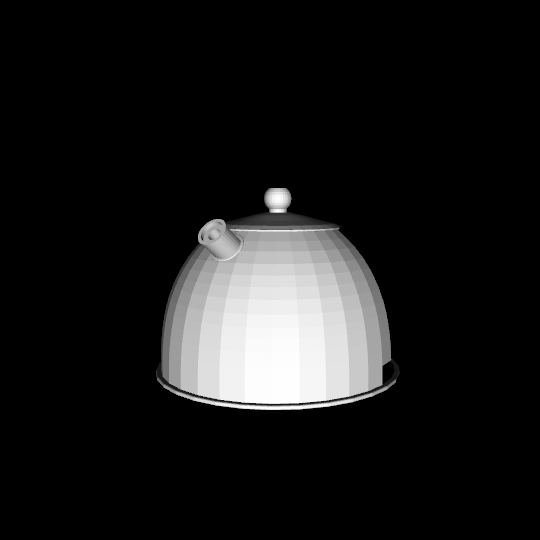
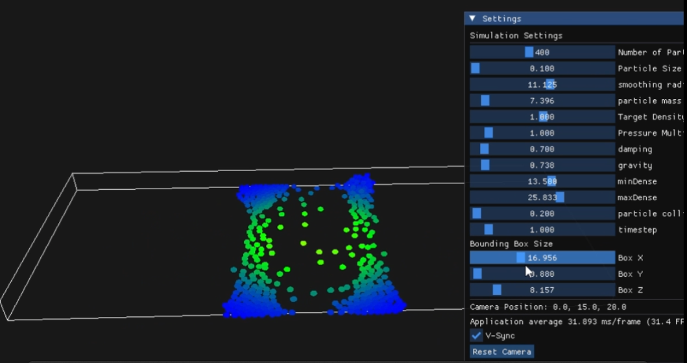

# PROJECT NGINE

The long term aspiration of this project is to become a small 3D engine that supports features I consider interesting Like importing models, basic mesh editing, particle simulation, Rigid body physics, rasterization and raytracing and perhaps eventually gaussian splatting. A specific aspect I intend to focus on is performing as much computation as possible on the GPU. As one might expect from the lack of structure of this project, the intention is not to produce a functionining product but purely to satisfy my curiosity.

## Features

- A small ad-hoc matrix/vector library that performs all nessicary matrix/vector math.  
- OBJ, PLY model loading  
- rasterization pipeline: 
- phong shading, texture sampling.
- SPH fluid simulation
- Gaussian Splatting (WIP)  



## Smoothed particle hydrodynamics fluid simulation



In this project we created a fluid simulation using smoothed particle hydrodynamics.  
based on this paper:

For a few particles the task, is fairly trivial as it can be computed on the cpu. However as soon as soon as we require more than a few hundred particles, the CPU struggles to maintain 60FPS as the pressure Force on each particle calculation requires checking every other particle.  
Therefore, we implement a spatial hashgrid to optimize neighbor search. The goal of the spatial hashgrid, is to allow us to only search neihboring particles for each particle, by partitioning particles into cells. Each cell is given a hash value. Particles are stored in a buffer. in a seperate buffer we store the keys to each particle, and we sort them by that key such that all particles in the same cell are stored consequitively. Finally a 3rd Buffer stores the starting indices of each cell which allows us to retrieve them immediately.

```cpp
particle Buffer: [0,1,3,4,5,6,7,8,9,10,11]

spatialKeys Buffer: [0,0,0,1,1,2,2,2,2,3,3]  
                      ^      ^   ^       ^  
                     cell 0 Cell 1      Cell 3


spatialOffsets Buffer: [0,3,5,9]
                       C0,C1,C2,C3 starting indices
```
## Part 1: Architecture

Diagram: https://link.excalidraw.com/readonly/2ZFC8EoQpxyAGCf7Qpm9
### 1.1 High-Level Structure

The engine is structured as:

- **Application** – Owns the GLFW window, config, and scene; runs the main loop (`init` → `run`); owns the SPH simulator, Phong shader, particle renderer, Gaussian renderer, and the render pipeline. Single entry point from `main()`.
- **Config / AppArgs** – Centralized window size, FOV, near/far, and all asset paths (OBJ, textures, shaders). Paths are derived from a single `basePath` via `resolvePaths()`. CLI is minimal (`--ply <path>`).
- **Scene** – Holds camera, mesh + texture, Gaussian list, model transform, lighting (direction, color, ambient/specular), background color, and UI flags. Single “world” state used by the pipeline.
- **Camera** – Position, yaw (radians), up vector, FOV. Produces view matrix via look-at + invert and projection via a custom perspective helper.
- **RenderPipeline** – Given scene and simulator, performs a fixed draw order: clear → Phong mesh → (optional) Gaussian splats → particles → ImGui. It also runs the ImGui control panels and syncs them with the scene.

**approach:** One application, one scene, one pipeline, explicit ownership (Application owns subsystems, Scene owns mesh/Gaussians/camera). No ECS, no generic “entity” list.


### 1.2 Rendering Pipeline Order

Fixed sequence each frame:

1. Clear color and depth.
2. **Phong pass** – Opaque mesh with depth test and depth write.
3. **Gaussian pass** (if any) – Blend enabled, depth test **disabled**, depth write off; draw order is **back-to-front** from CPU sort; premultiplied alpha.
4. **Particle pass** – Blend, depth test (LEQUAL), no depth write; points from SSBO.
5. **ImGui** – On top.


### 1.3 Ownership and Lifetimes

- **Application** creates and owns: `SPHSimulator*`, `shader*` (Phong), `ParticleRenderer*`, `GaussianRenderer*`, `RenderPipeline*`, and holds `Scene` by value. On exit it deletes the pointers and calls `scene_.destroy()` (mesh + texture).
- **RenderPipeline** receives raw pointers to the Phong shader and the two renderers; it does not own them.
- **Scene** owns `MeshGPU` and the `GLuint` texture; `destroy()` releases them. It holds `std::vector<Gaussian>`; the Gaussian renderer receives this by const reference and builds a sorted GPU buffer per frame.

